# Utilizando AI Search para indexação e consulta de Dados

## Introdução

Neste laboratório será apresentado a utilização de IA para indices de buscas e consulta de dados.

## Início

Primeiro passo foi a criação de um novo recurso: 
    * Azure AI Services - Azure AI Search - criar.
    * Foram preenchidos os dados e finalizado a criação.

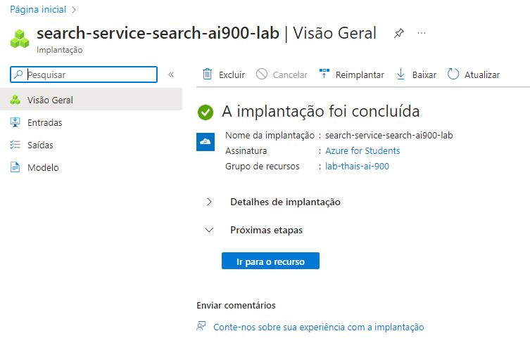

Segundo passo foi a criação de mais um recurso: 
    * Criar recurso - IA + Machine Learning - Serviços Cognitivos - criar.
    * Foram preenchidos os dados e finalizado a criação.

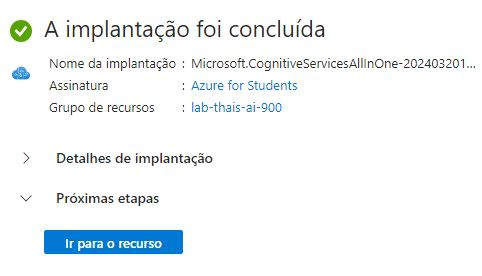

Terceiro passo foi a criação de contas de armazenamento
    * Criar - preencher os dados e finalizar

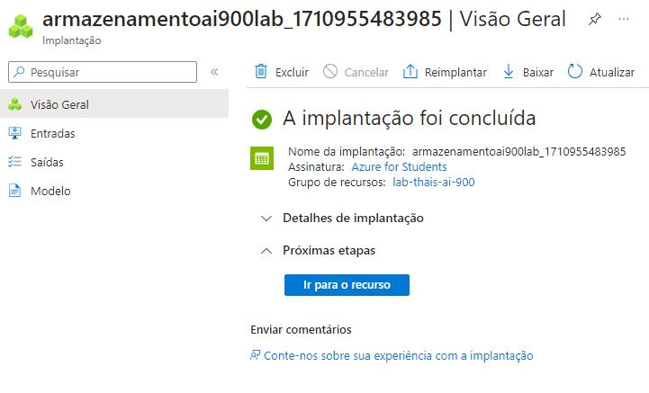

Após a criação, abri as informações do recurso, acessei as configurações e habilitei a opção *Permitir acesso anônimo ao Blob* e salvei.

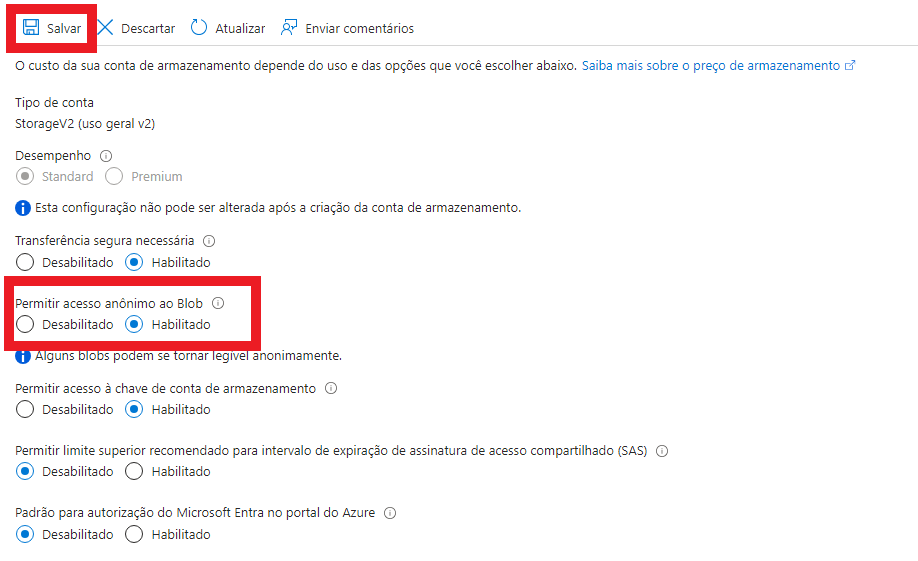

Depois acessei outra opção em Armazenamento de Dados - Contêineres e crie um novo contêiner.

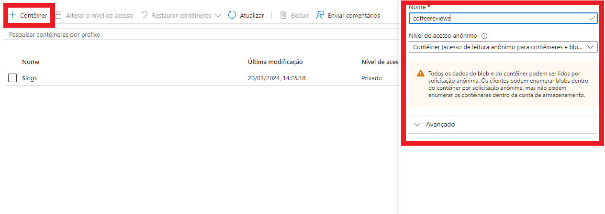

Fiz o carregamento dos arquivos .doc do blob.

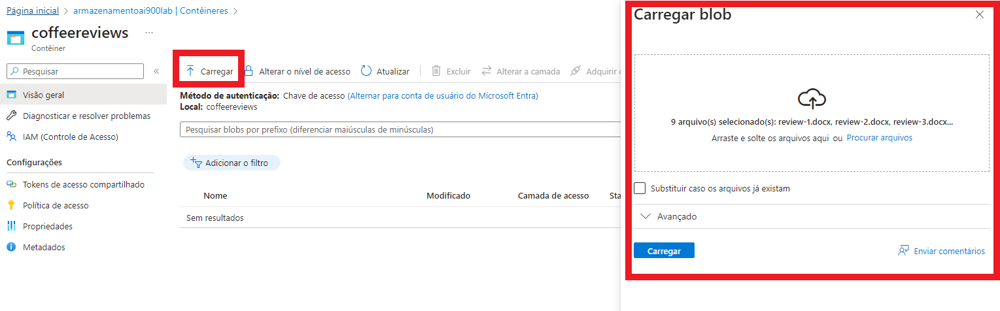

Depois fiz o acesso ao meu recurso de pesquisa e clico em *importar dados* e inseri as seguinte informações e cliquei em adicionar habilidades...

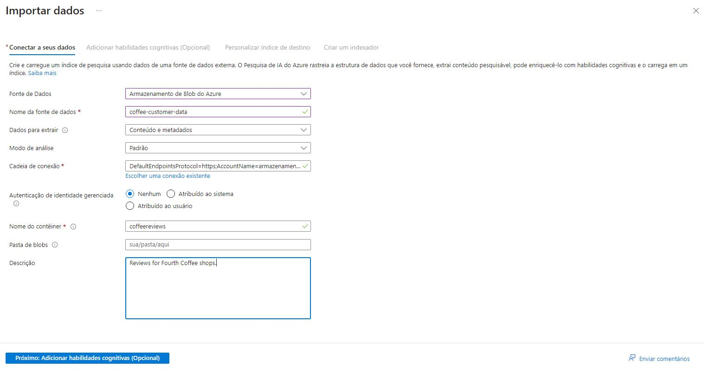

Em adicionar habilidades, preenchi da seguinte forma:

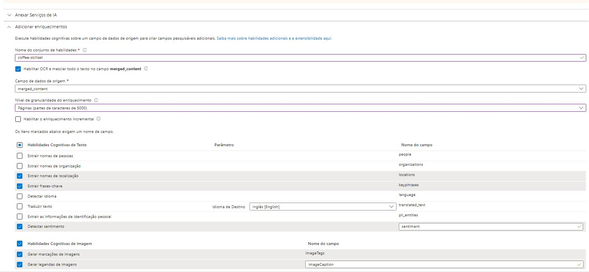
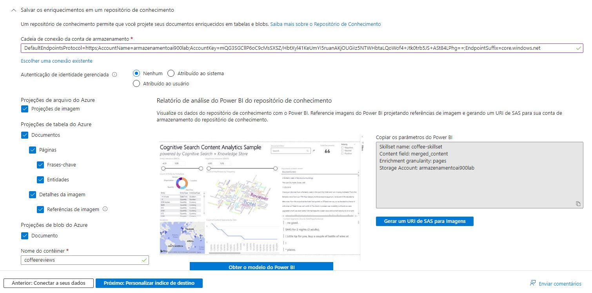

Depois cliquei em *Personalizar índice destino*, preenchi as informações e depois cliquei em *criar um indexador*.

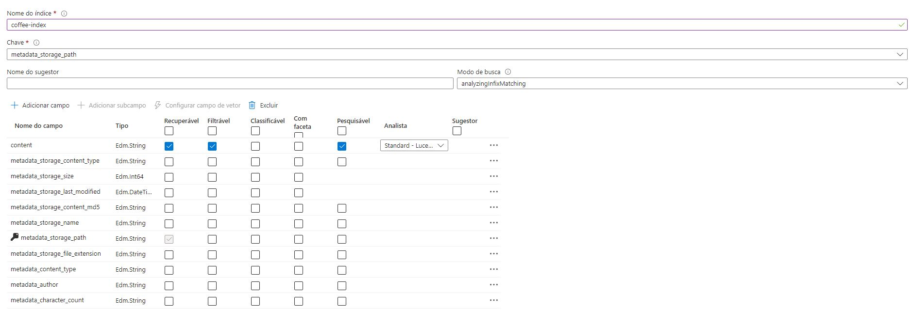
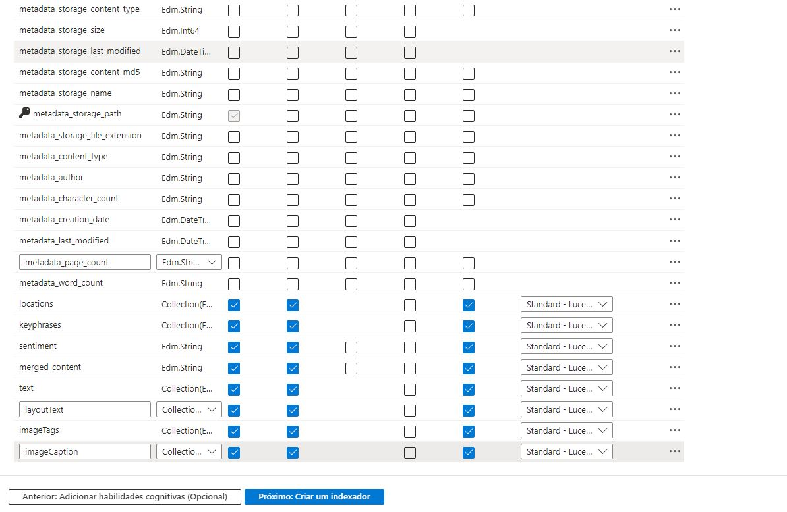

Foi preenchido da seguinte forma e cliquei em enviar.

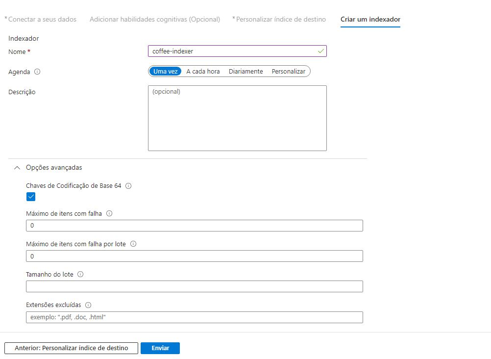

Indexação concluída com sucesso 

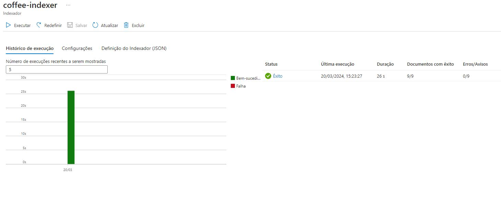

Após acessei o Azure AI Search - clico no recurso - gerenciador de pesquisas e fiz uma pesquisa conforme imagem abaixo:

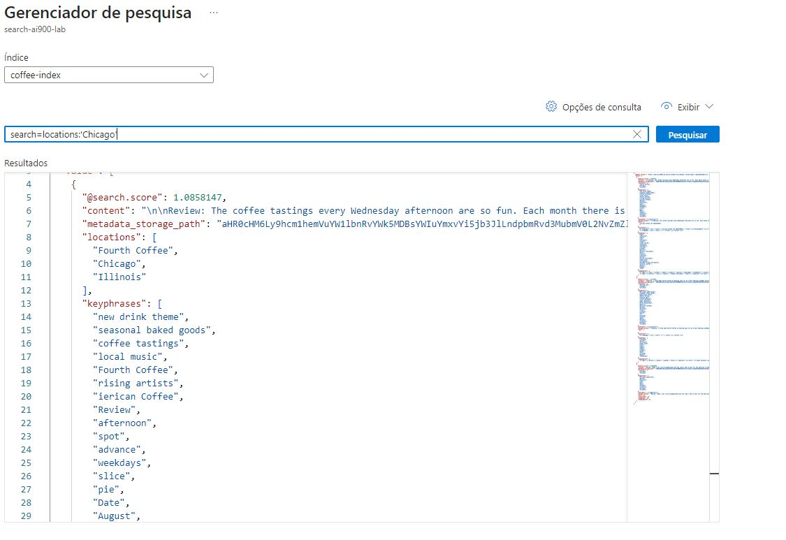

## Conclusão

Neste laboratório foi possível ter mais conhecimento referente a utilização de IA para indices de buscas e consulta de dados, que é um mecanismo de pesquisa para indexação, pesquisa de texto completo, busca em vetores, pesquisa híbrida e consultas filtradas. 

**OBS: os recursos foram excluídos no final do laboratório**